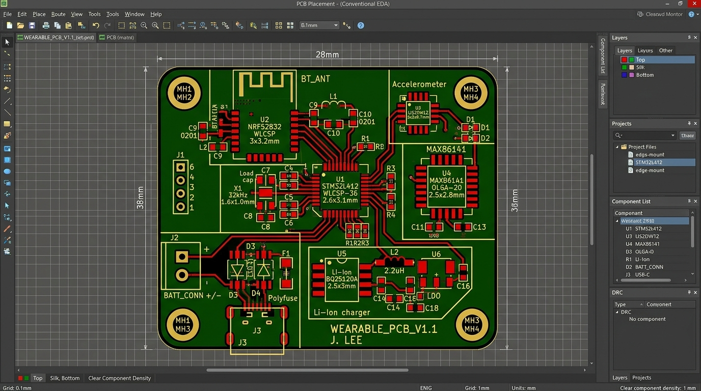
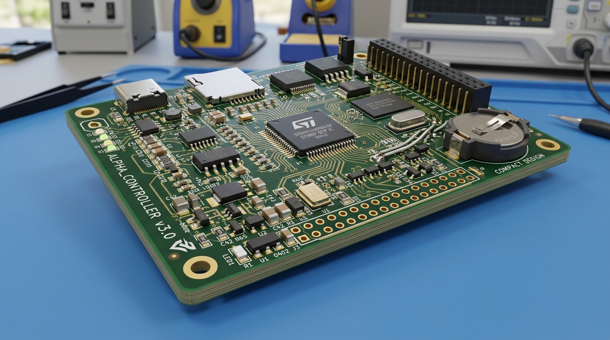
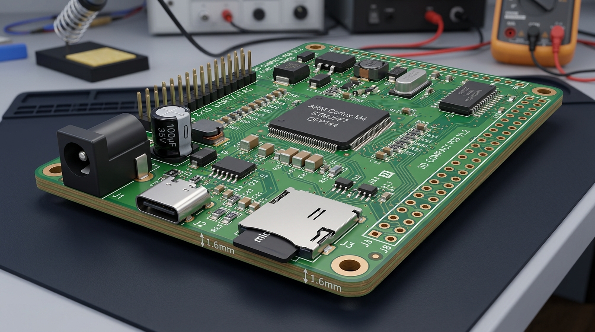

# Wearable PCB Design & Development

Professional PCB design and development for compact wearable electronic devices.

This portfolio covers PCB concepts and designs for smartwatches, fitness trackers, smart bands, health-monitoring devices, wireless wearables, compact sensors, flexible electronics, battery-powered devices, and other portable wearable products.

## Wearable PCB Applications

- Smartwatch electronics
- Fitness trackers
- Smart bands
- Health-monitoring wearables
- Wireless wearable devices
- Compact sensor devices
- GPS-enabled wearables
- Bluetooth wearable devices
- Battery-powered wearable electronics
- Flexible and compact PCB designs
- Sports and fitness electronics
- Portable monitoring devices
- Wearable safety devices
- Smart accessories
- Custom wearable electronics

## Design Focus

The design process can include:

- Circuit and schematic development
- Component selection
- PCB layout
- Compact component placement
- Signal and power routing
- Power management
- Battery integration
- Bluetooth and wireless connectivity
- Sensor integration
- Microcontroller integration
- Connector selection
- Design for manufacturing
- PCB assembly preparation

## PCB Design Workflow

1. Product requirements review
2. Component and circuit planning
3. Schematic development
4. Component selection
5. PCB stack-up and board planning
6. Component placement
7. PCB routing
8. Design rule checking
9. 3D design review
10. Manufacturing preparation

## Portfolio

### Schematic Design

Circuit schematics showing electronic architecture, components, power sections, sensors, controllers, and communication interfaces.

### PCB Layout

Compact PCB layout focused on component placement, routing, power distribution, signal integrity, and practical board dimensions.

### 3D PCB Design

3D visualization for reviewing component placement, board dimensions, clearances, and overall mechanical arrangement.

### Assembly

Assembly-oriented documentation and PCB views for prototype development and manufacturing preparation.

## Key Deliverables

Depending on project requirements, deliverables may include:

- Schematic files
- PCB layout files
- PCB design source files
- Gerber files
- Drill files
- Bill of Materials (BOM)
- Pick-and-place files
- Component placement documentation
- Manufacturing documentation
- 3D PCB files
- Assembly documentation

## Wearable Design Considerations

Wearable PCB development may require attention to:

- Compact board dimensions
- Low power consumption
- Battery constraints
- Component availability
- Wireless connectivity
- Sensor placement
- Heat considerations
- Mechanical constraints
- User comfort
- Manufacturing requirements
- Prototype and production requirements

## Tools & Technologies

PCB projects may involve:

- KiCad
- Altium Designer
- STM32
- ESP32
- Bluetooth / BLE
- Sensors
- Microcontrollers
- Battery-powered electronics
- Flexible PCB technologies
- Surface-mount components

## Manufacturing Preparation

PCB manufacturing outputs can include:

- Gerber files
- NC drill files
- BOM
- Pick-and-place files
- Assembly drawings
- Fabrication documentation
- PCB inspection documentation

## Custom Wearable PCB Development

Custom wearable PCB projects can be developed around specific product requirements, mechanical constraints, electronic functions, and manufacturing needs.

For collaboration, provide the product requirements, electrical functions, dimensions, components, and manufacturing requirements where available.

## PCB Design Portfolio

### Schematic Design

### PCB Layout

.jpeg)

.jpeg)

.jpeg)

.jpeg)

.jpeg)

.jpeg)

### Component Placement

### 3D PCB Views

.jpeg)

.jpeg)

### Manufacturing Documentation

### Prototype

